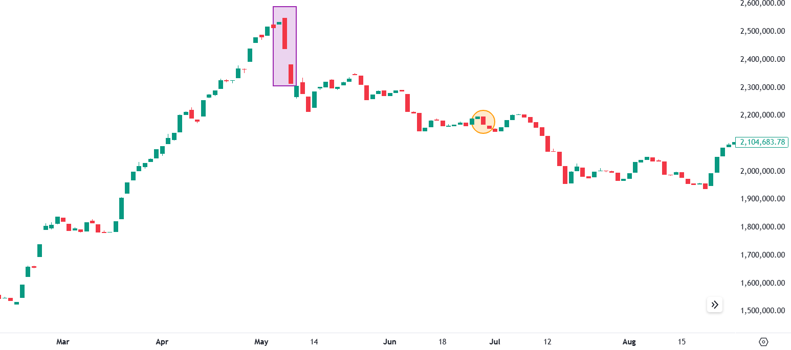
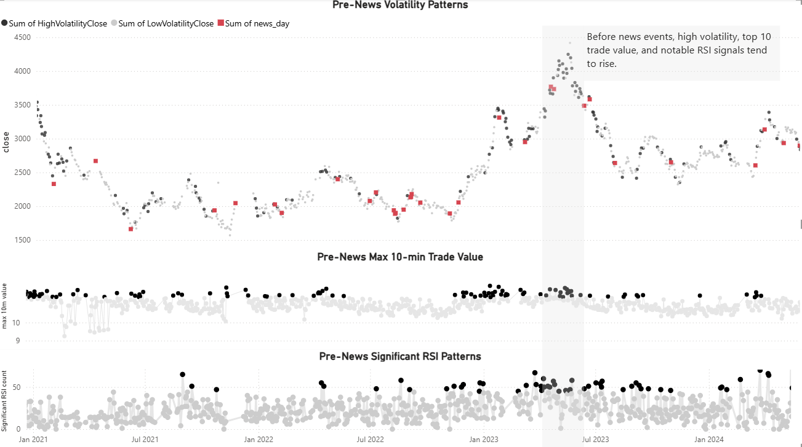
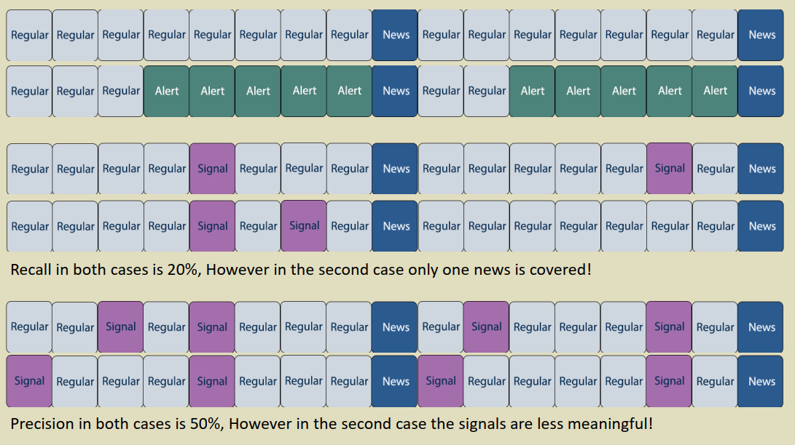
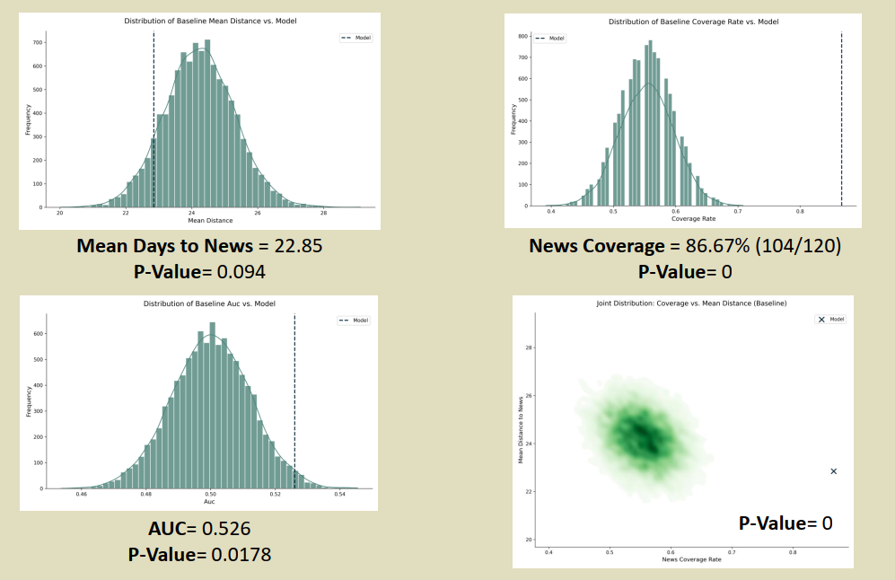
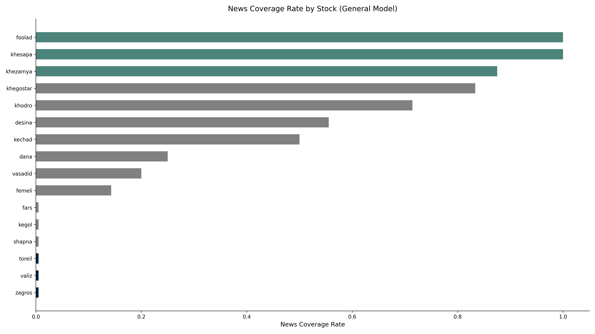
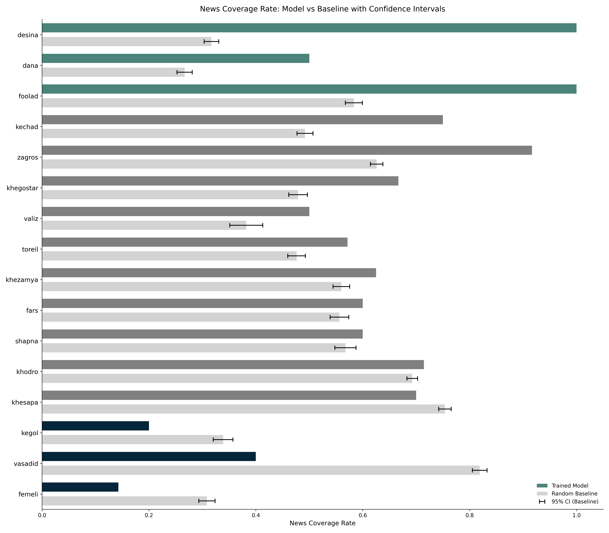
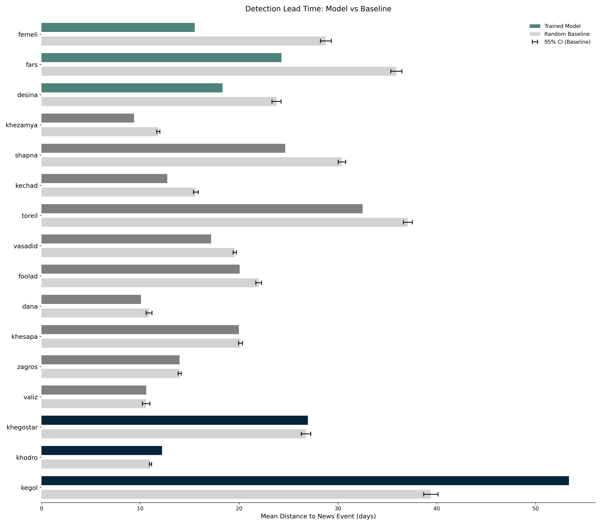
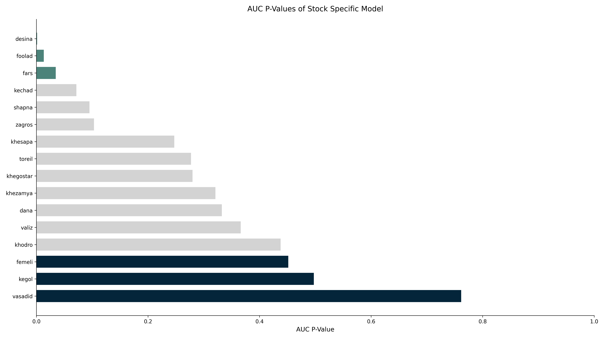

## Project Overview

This research project addresses persistent rumors of insider trading in the Iran stock market by developing a sophisticated machine learning system that detects anomalous trading patterns preceding significant news announcements. Our work demonstrates that systematic analysis of high-frequency market data can reveal patterns consistent with informed trading, providing regulatory authorities with valuable tools for market surveillance and compliance monitoring.

*Figure 1: The "Black Sunday" event in Iran's stock market index - A massive red candlestick following a prolonged uptrend, later linked to leaked information about raw material price increases for petrochemical companies. This event, where insiders appeared to act on non-public information 56 days before official announcement, motivated our investigation into detecting such patterns systematically.*

## Research Motivation

The project originated from widespread market speculation about unequal access to corporate information, where certain participants appeared to trade advantageously before official news releases. These suspicious trading activities, particularly evident in the week preceding major announcements (as dramatically demonstrated in Figure 1), suggested potential insider trading practices. We hypothesized that such activities would generate detectable patterns in market microstructure data, enabling the development of predictive models that could both identify potential insider trading and assess corporate transparency.

## Data Collection and Challenges

Acquiring appropriate data presented significant challenges, as no existing datasets contained the necessary high-frequency trading information. We developed comprehensive web scraping solutions to collect:

- **Tick-level trading data** from TSETMC (Iran's central stock market website)
- **Corporate announcements** from CODAL (the official news dissemination platform)
- **Historical price adjustments** accounting for splits and dividend payments

We specifically focused on sudden, material announcements rather than periodic disclosures, as these unexpected news events create significant market movements and are more likely to involve insider trading.

## Technical Methodology

### Exploratory Data Analysis and Initial Findings

*Figure 2: Visualization of trading patterns preceding news announcements. Red dots indicate news release days, blue dots show high volatility days, and gray dots represent normal trading days. The increased density of blue dots (high volatility) before red dots (news events) suggests anomalous trading activity potentially indicating information leakage.*

Our initial exploratory analysis revealed compelling visual evidence of unusual trading patterns before official news releases. As shown in Figure 2, we observed statistically significant increases in volatility and unusual trading volume in the days preceding material announcements, providing preliminary support for our hypothesis about detectable insider trading patterns.

### Data Preprocessing Pipeline

We developed a sophisticated data processing pipeline that transformed raw tick data into analyzable features:

1. **Temporal Aggregation**: Converted tick data to 1-minute intervals, capturing OHLC, volume, trade count, and other market microstructure features
2. **Adjustment Processing**: Applied correction factors for corporate actions to ensure price consistency
3. **Feature Engineering**: Created 25+ technical and statistical features including:
   - Multiple return metrics (open, high, low, close, average price)
   - Technical indicators (RSI, Bollinger Bands, Ichimoku Cloud components)
   - Volume and trade-based metrics
   - Price pattern recognition features
   - Volatility measures at multiple timeframes

### Novel Evaluation Framework

*Figure 3: Demonstration of why traditional precision and recall metrics are inadequate for evaluating news prediction models. The visualization shows four different model outputs with identical precision/recall scores but substantially different practical utility for detecting impending news events.*

Recognizing the limitations of conventional evaluation metrics for this problem domain (illustrated in Figure 3), we developed specialized assessment criteria:

1. **News Coverage Percentage**: Measures what percentage of news events were preceded by alerts within the detection window
2. **Median Days to News**: Captures the typical lead time between alerts and actual news announcements

### Machine Learning Framework

We implemented a comprehensive modeling approach with rigorous validation:

*Figure 4: Statistical validation through Monte Carlo simulations. The histograms show distribution of results from 10,000 random baseline simulations for (A) mean days to news, (B) news coverage rate, and (C) AUC. The bottom-right panel shows joint distribution of news coverage and mean days to news, with our model's performance (marked with X) significantly outperforming random chance.*

Our best-performing ANN model demonstrated statistically significant predictive ability, outperforming random baselines with p-values of 0.003 for news coverage and 0.07 for mean days to news (Figure 4). This rigorous statistical validation confirmed that our detected patterns were unlikely to occur by random chance.

## Key Findings and Results

### Cross-Company Analysis

*Figure 5: Performance variation across different stocks. The horizontal bar chart shows the coverage rates for each stock, revealing substantial differences in predictability across companies. Notably, the model achieved 0% news coverage for 6 stocks while performing exceptionally well on 3-5 others.*

Our analysis revealed significant variation in predictability across different stocks (Figure 5). This cross-company analysis suggested that information leakage patterns were not uniform across the market, with some companies showing much stronger evidence of pre-news trading anomalies than others.

### Stock-Specific Modeling

*Figure 6: Comparison of stock-specific model performance versus random baselines. The bar plots show news coverage (top) and mean distance to news (bottom) for each stock, with model performance (darker gray) compared against Monte Carlo simulation results (gray). Stocks are sorted by performance difference, with top and bottom performers highlighted.*

To investigate whether the performance variation resulted from modeling limitations or genuine differences in information leakage, we developed stock-specific models (Figure 6). The consistent underperformance on certain stocks across both general and specialized models suggested authentic differences in corporate transparency rather than modeling artifacts.

### Regulatory Implications

*Figure 7: Statistical significance of detection capability across different stocks. The horizontal bar plot shows p-values for each stock's predictability, sorted from most detectable to least detectable. The green-highlighted stocks at the top show strongest evidence of information leakage, suggesting potential need for regulatory scrutiny.*

Our most significant finding emerged from analyzing detection difficulty across different companies (Figure 7). The substantial variation in predictability, with some stocks showing highly statistically significant patterns and others showing no detectable patterns, suggests differential information control practices across companies. This finding provides quantitative evidence that could guide regulatory focus toward companies with the strongest evidence of information leakage.

## Technical Implementation

The project involved developing several sophisticated technical components:

### Scalable Data Infrastructure
- MySQL database managing 300+ MB of market data
- Configurable data preprocessing pipeline supporting multiple feature sets and time windows
- Automated data validation and quality checks

### Machine Learning Pipeline
- Modular architecture for easy model experimentation and comparison
- Hyperparameter optimization through grid search
- Comprehensive evaluation framework with custom metrics
- Production-ready model deployment system

### Visualization and Reporting
- Interactive Tableau dashboards for exploratory data analysis
- Automated report generation for model performance
- Visual storytelling of detection patterns and results

## My Contributions

As a key member of the three-person team, my specific contributions included:

- Designing and implementing the feature engineering pipeline
- Developing the novel evaluation metrics (News Coverage Percentage and Median Days to News)
- Creating the statistical validation framework using Monte Carlo simulations
- Building the interactive Tableau dashboards for result visualization
- Implementing the RNN/LSTM models for temporal pattern detection
- Coordinating the integration of multiple data sources

## Impact and Applications

This research demonstrates the potential for machine learning approaches to enhance market surveillance and detection of illicit trading activities. The methodology developed could be valuable for:

- **Regulatory bodies** seeking to identify potential insider trading
- **Financial institutions** monitoring for suspicious activities
- **Academic researchers** studying market microstructure and information asymmetry
- **Corporate governance** professionals assessing information disclosure practices

## Future Directions

Several promising extensions of this work remain for future research:

- Incorporating natural language processing of news content
- Expanding to additional market data sources and international markets
- Developing real-time detection capabilities
- Exploring ensemble methods combining multiple detection approaches
- Investigating cross-market information leakage patterns

The complete technical report and codebase are available upon request to interested researchers.