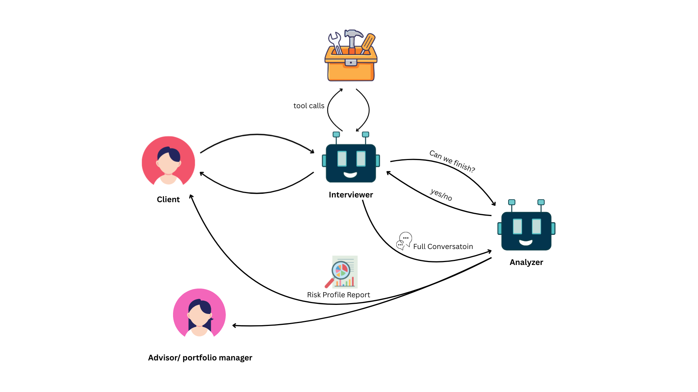
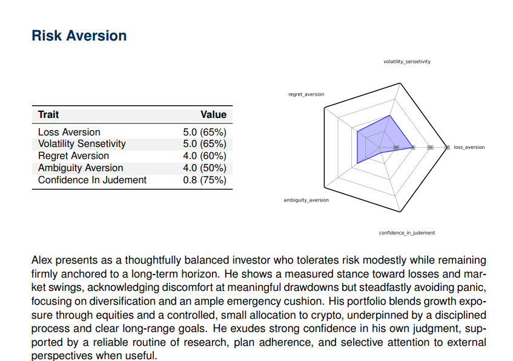

## Abstract

Investor risk profiling is critical for aligning financial advice with clients' risk tolerance, yet traditional methods face fundamental limitations: questionnaires lack depth and personalization, while human interviews are resource-intensive and unscalable. This research introduces a novel adaptive LLM-based system that conducts dynamic, conversational interviews to gather nuanced investor insights. Our two-agent architecture—featuring an adaptive interviewer and risk analyzer—adjusts question complexity based on user expertise, explores key risk dimensions through phased questioning, and generates structured reports with numerical scores, narratives, and visualizations. Preliminary evaluations demonstrate promising results in coherence, adaptability, and depth of assessment, suggesting strong potential for enhancing both user experience and profiling accuracy in financial advisory contexts.

## Video Demonstration

  <iframe src="https://www.youtube.com/embed/VIDEO_ID_HERE" style="position: absolute; top: 0; left: 0; width: 100%; height: 100%; border: 0;" allowfullscreen title="Adaptive LLM Risk Profiling System Demonstration"></iframe>

*This 3-minute overview demonstrates the system's conversational flow, adaptive questioning strategy, and report generation capabilities. [Full video available upon request]*

## Interactive Demo

Experience the adaptive interviewer through our Telegram bot: [@agentic_risk_profiler_bot](https://web.telegram.org/k/#@agentic_risk_profiler_bot) or on the [website](http://46.249.101.59:8000/). The interface demonstrates the system's conversational capabilities and adaptive questioning strategies in real-time.

## Research Significance

Accurate risk profiling ensures investment recommendations match clients' financial situations and objectives while complying with regulatory frameworks (SEC, ESMA, MiFID II) that mandate thorough KYC processes. Current industry approaches remain limited by the efficiency-depth tradeoff: standardized questionnaires are scalable but impersonal, while interviews provide deeper insights but are resource-intensive. 

This work bridges this gap by leveraging recent advances in large language models to create adaptive, engaging interviews that scale like questionnaires but provide the depth of human interactions. Our approach has significant implications for financial advisory practice, potentially enhancing compliance, client trust, and portfolio customization while reducing administrative burdens.

## Methodology

### Modular Agent Architecture

We designed a novel two-agent system that separates conversational and analytical components:
- **Dynamic Interviewer Agent**: Conducts adaptive conversations using three mechanisms:
  1. Expertise-aware questioning (estimating proficiency from language complexity)
  2. Question selection (targeting informational gaps)
  3. Conversational flow maintenance (using full history for coherence)
  
- **Risk Analyzer Agent**: Processes dialogue into structured outputs across configurable dimensions (Risk Aversion, Capacity, Experience, Time Horizon, Volatility Management, Social Influencers), each with 5-6 metrics.

### Interview Process

The system employs a structured four-phase approach:

1. **Initial Assessment**: Gauges baseline knowledge through open-ended questions
2. **Broad Exploration**: Systematically covers all risk dimensions
3. **Focused Deep Dive**: Probes ambiguities and inconsistencies with scenario-based questions
4. **Gap Resolution**: Ensures completeness by consulting the analyzer for missing information

### Technical Implementation

Our implementation uses DeepSeek V3 but is model-agnostic, allowing flexibility for future deployments. The system incorporates specialized tools including:
- Scenario generator for personalized hypotheticals
- Proficiency estimator for adapting question complexity
- Termination assistant for determining data completeness
- Structured output generation via Pydantic for reliable reporting

## Preliminary Results

Our evaluation strategy includes both synthetic testing and preliminary human trials:

### Synthetic Evaluation
- Employed Grok 4 to generate artificial investor personas with predefined risk preferences
- System consistently produced reports with high internal consistency and alignment with assigned profiles
- Captured nuanced preferences across dimensions that traditional questionnaires typically miss

### Self-Administered Testing
- Project team and supervising professor engaged in multiple trials
- Demonstrated natural flow, adaptability, and conversation depth
- Superior coherence compared to traditional tools as noted by supervising professor

## Future Research Directions

This ongoing research project will expand in several directions:

1. **Controlled Human Evaluation**: Within-subjects experiment with 20 participants comparing our system against standardized questionnaires
2. **Integration Enhancement**: Incorporating historical trading data for deeper behavioral profiling
3. **Framework Expansion**: Adapting the system for trader self-assessment and portfolio manager evaluation
4. **Advanced Scenario Testing**: Developing Monte Carlo-style simulations for quantitative skill assessment

## Contributions

This collaborative research project represents joint work with Farnoush Fallah under the supervision of Dr. Barak at the University of Southampton.

**Farjad Fallah** designed and implemented the interviewer agent, developed the Telegram bot interface, handled system integration, and conducted synthetic testing.

**Farnoush Fallah** designed and implemented the analyzer agent, conducted literature review on risk profiling methodologies, and created the report generation framework.

## Publication Status

This work originated as a final project for an advanced LLM course and is now being developed into a full research paper under Dr. Barak's supervision at the University of Southampton. The complete technical report is available upon request.

<!-- 
<!-- ---
title: "Adaptive LLM Interviews for Investor Risk Profiling"
collection: research
category: manuscripts
permalink: /research/adaptive-llm-risk-profiling
excerpt: 'Leveraging AI for personalized, scalable investor risk assessments, enhancing accuracy and user experience through dynamic questioning'
author_profile: true

---

## Project Summary
Investor risk profiling is essential for aligning financial advice with clients' risk tolerance, capacity, and goals, yet traditional methods like questionnaires lack depth and personalization, while human interviews are unscalable. This project introduces an adaptive LLM-based system that conducts dynamic, conversational interviews to gather nuanced investor insights. Using a two-agent architecture—an adaptive interviewer and a risk analyzer—the system adjusts question complexity based on user expertise, explores key risk dimensions through phased questioning, and generates structured reports with numerical scores, narratives, and visualizations. Originally developed as a final project for an LLM course, this work is now an ongoing research effort under the supervision of Dr. Barak at the University of Southampton, with potential for publication.

---

## Demo
Experience the adaptive interviewer through our Telegram bot: [@agentic_risk_profiler_bot](https://web.telegram.org/k/#@agentic_risk_profiler_bot). If the bot is unavailable, please contact me at [farjadfallah@gmail.com](mailto:farjadfallah@gmail.com) and I will ensure it is operational for your evaluation.

A brief video overview of the system’s concept and architecture: (Video placeholder — embed once uploaded to YouTube/Vimeo/MP4)

---

## Motivation
Accurate risk profiling ensures investment recommendations match clients' financial situations, objectives, and risk appetites, preventing undue losses or missed opportunities. Regulatory frameworks like SEC, ESMA, and MiFID II mandate thorough KYC (Know Your Client) processes to uphold suitability standards, with non-compliance risking penalties and reputational harm. However, static questionnaires often feel impersonal and fail to capture behavioral nuances, while in-depth interviews are resource-intensive. This project bridges the gap by harnessing LLMs for adaptive, engaging interviews that scale like questionnaires but provide the depth of human interactions, ultimately equipping portfolio managers with richer insights for better-tailored advice.

---

## Our Approach: Modular Two-Agent System
We employ a modular architecture with two LLM agents powered by DeepSeek V3 (model-agnostic for flexibility). The Dynamic Interviewer Agent conducts conversations, adapting via three mechanisms: expertise-aware questioning (estimating proficiency from language complexity), question selection (targeting informational gaps), and conversational flow maintenance (using full history for coherence). It leverages tools like a scenario generator for personalized hypotheticals, a proficiency estimator, and a termination assistant to check data completeness with the analyzer.

The interview unfolds in four phases: Initial Assessment (gauging baseline knowledge), Broad Exploration (covering all risk dimensions), Focused Deep Dive (probing ambiguities), and Gap Resolution (ensuring completeness). The Risk Analyzer Agent then processes the dialogue into structured outputs across dimensions like Risk Aversion, Risk Capacity, and Time Horizon, producing numerical scores (via Pydantic), three-paragraph narratives per dimension, radar charts, tables, and a comprehensive PDF report.

This design enhances scalability, user engagement, and compliance, capturing subtle factors like emotional responses and family influences often missed by traditional methods.

---

## Dataset & Experiments
No pre-existing dataset was used; instead, conversational data was dynamically generated through system interactions. The current dataset includes self-administered interviews by the team and supervising professor, plus synthetic interviews with LLM-generated personas (e.g., using Grok 4 to role-play investors with predefined profiles). For preliminary evaluation, we conducted self-trials noting natural flow and depth, and synthetic tests assessed report consistency and alignment via LLM-as-a-judge (Grok 4).

A planned within-subjects experiment with 20 participants (postponed due to constraints) will compare our system against standardized questionnaires in randomized order, evaluating user experience (Likert scales on engagement, empathy) and accuracy (alignment with expert annotations on dimensions like loss aversion).

---

## Key Results
Preliminary self-tests and synthetic evaluations showed promising results: the system maintained coherent dialogues, adapted effectively to proficiency levels, and generated reports aligning well with assigned personas. For instance, in synthetic trials, reports captured nuanced preferences across dimensions with high internal consistency. Compared to baselines like static questionnaires, our approach provided deeper behavioral insights, though quantitative alignment awaits full user studies.

Here is a sample of one of the six sections of the risk profile of Alex (a role-played client emulated by Grok 4), illustrating the system's ability to generate detailed, visually supported insights from dynamic dialogues:

---

## My Contribution
This was a collaborative effort with my sister, Farnoush Fallah. Farnoush designed and implemented the analyzer agent, conducted the literature review on risk profiling, and created the report generation tool. I (Farjad Fallah) designed and implemented the interviewer agent, built the Telegram bot interface, and handled integration. We jointly handled testing, with guidance from our supervising professor at the University of Southampton. The source code is available [here](https://github.com/farjadfallah/agentic_risk_profiler).

---

## Draft Paper
This work originated as a course final report and is being refined for potential publication under Dr. Barak's supervision. The full report PDF is available upon request. I'm more than happy to discuss this project or explore collaboration opportunities.
 -->
 -->

