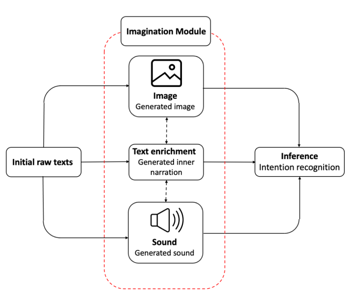

## Overview

MIIRA is a novel framework that equips AI systems with an imagination module to resolve ambiguity in human-robot interaction. Inspired by human cognition, MIIRA generates internal multimodal simulations—narrative, visual, and auditory—from minimal textual instructions. By enriching sparse commands with this imagined context, MIIRA significantly improves a model's ability to infer intent in complex, underspecified domestic scenarios, as validated by state-of-the-art performance on the HandMeThat-v2 benchmark.

**Keywords:** Intent Recognition, Human-Robot Interaction, Multimodal AI, Imagination-Augmented Reasoning, Ambiguity Resolution

*A short 3-minute video presentation of this project. (Placeholder - replace VIDEO_ID)*

## Motivation

A fundamental challenge in human-robot interaction (HRI) is the ambiguity inherent in natural language. Commands like "hand me that from the sofa" require a robot to infer the referent of "that" based on rich contextual understanding. Traditional text-only models lack this grounding, leading to frequent misinterpretations. Humans naturally overcome this by engaging in mental simulation, visualizing scenes, recalling sounds, and constructing internal narratives. This work, conducted at the Speech and Language Processing Lab (SLPL) at Sharif University, investigates whether we can equip AI with a similar capacity for imagination to bridge the gap between abstract language and concrete intent.

## Methodology: An Imagination-Augmented Pipeline

MIIRA introduces a cognitive extension to multimodal language models through a structured, three-phase pipeline. The process begins with Text Enrichment, where a lightweight LLM (Qwen-3B) acts as a narrative simulator. It expands terse action labels (e.g., "pick up cup") into detailed, contextually-grounded descriptions. Crucially, we generate two distinct, modality-specific narratives: a visual enrichment focused on spatial layout, object attributes, and scene composition, and an audio enrichment focused on action-specific sounds and ambient noise.

This enriched narrative then feeds into the Multimodal Generation phase, where these textual descriptions are transformed into percepts. The visual narrative is rendered into a high-fidelity image using the Flux model, while the audio narrative is converted into a short, contextually-aligned sound clip using Stable Audio. This phase effectively translates the AI's "imagination" into a simulated perceptual experience.

Finally, in the Multimodal Fusion & Intent Recognition phase, the original instruction is combined with its generated context—the enriched text, image, and audio. This unified multimodal input is processed by a multimodal LLM (Qwen2.5-Omni 3B), which leverages the complementary strengths of each modality to accurately infer the user's goal, effectively resolving the ambiguities present in the initial command.

*The end-to-end MIIRA pipeline. Sparse text input is enriched through an internal imagination module that generates narrative, visual, and auditory context. These multimodal cues are fused to resolve referential ambiguity and accurately predict user intent.*

## Experimental Setup

We evaluated MIIRA on the HandMeThat-v2 dataset, a comprehensive benchmark containing 116,146 episodes designed to evaluate instruction understanding in physically and socially grounded contexts with four progressive levels of ambiguity. To ensure computational tractability, we curated a representative 400-episode subset, sampling evenly across the dataset's goal templates and difficulty levels. Our evaluation employed the Full Accuracy metric, the strictest criterion which requires a model to correctly identify both the target object's category and its specific instance. We conducted a systematic ablation study to evaluate the contribution of each modality—text, enriched text, image, and audio—both in isolation and in combination across all difficulty levels.

## Key Results & Findings

Our controlled experiments reveal a clear and compelling story about how different modalities contribute to disambiguation. We found that the addition of generated images yielded the largest performance gains, especially at intermediate difficulty levels (Levels 2-3). These visual cues provide essential appearance and layout priors that help the model answer foundational questions about *"what"* object is involved and *"where"* it is located.

However, in the most complex scenarios characterized by high referential ambiguity (Level 4), the Text + Enriched Text combination proved most decisive. Here, the internal narrative's explicit statement of relational constraints (e.g., "inside the blue cabinet") becomes critical for answering the precise question of *"which one"* among several candidate objects.

This points to a natural division of labor between modalities: images are most effective for anchoring object category recognition, while enriched text excels at the finer-grained task of instance-level disambiguation. Their combination is synergistic, not redundant. In contrast, audio provided more limited gains, a result we attribute to current limitations in text-to-audio generation quality and semantic alignment rather than an intrinsic irrelevance of the auditory modality.

The table below summarizes the performance across different modality combinations and task difficulty levels, illustrating these findings.


*Performance comparison of various modality combinations on the HandMeThat-v2 dataset. Text + Image performs best at intermediate levels, while Text + Enriched Text excels under high ambiguity (Level 4).*

## My Contributions

I co-led this research project at SLPL, taking primary responsibility for the design and implementation of the core technical pipeline. My work encompassed the end-to-end development of the imagination module. I designed and implemented the text enrichment pipeline, which involved developing and rigorously testing the "reasoning" and "no-reasoning" prompting strategies to generate high-quality visual and auditory descriptions.

Furthermore, I built the complete multimodal simulation pipelines from the ground up, integrating state-of-the-art generative models like Flux for images and Stable Audio for sound. A key challenge here was ensuring precise temporal and semantic alignment between the generated percepts and the dataset episodes. I also executed the comprehensive ablation study, designing the experimental protocol and running all evaluations across the multitude of modality combinations and difficulty levels to derive the project's core insights. This work is ongoing, and I am currently refining these experiments with larger foundation models to further boost performance before final submission.

## Publication

This work is under active development and preparation for submission to a high-impact conference in computational linguistics and AI (e.g., ACL, EMNLP, NeurIPS). A draft is available upon request to interested researchers and potential collaborators. For further information, please feel free to contact me at [farjadfallah@gmail.com](mailto:farjadfallah@gmail.com).
